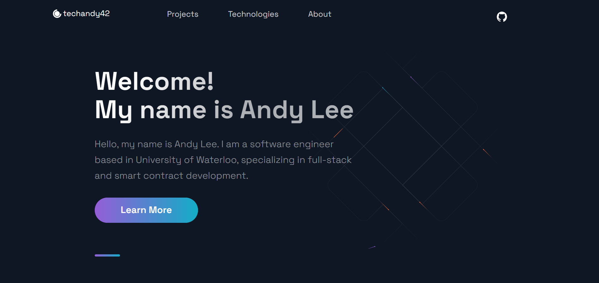

### Hi there 👋, My name is Andy Lee

> Personal Website

_Click the image to go to my website._

---

Email: techandy42@gmail.com

---

I am a full-stack, blockchain developer learning Computer Science at the University of Waterloo.

Skills: Javascript / Typescript / Python / Java / Racket / C / React / Next.js / Redux / Material UI / Express / MongoDB / Mongoose / PostgreSQL / Prisma / Solidity / Git 

- 🔭 I’m currently working on a business tokenization start-up
- 🌱 I’m currently learning Solidity
- 📫 How to reach me: techandy42@gmail.com 
  
---

---

  
  
---
  
## Projects Overview
  

